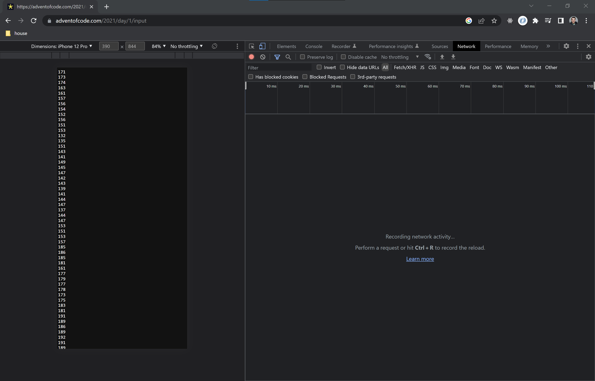
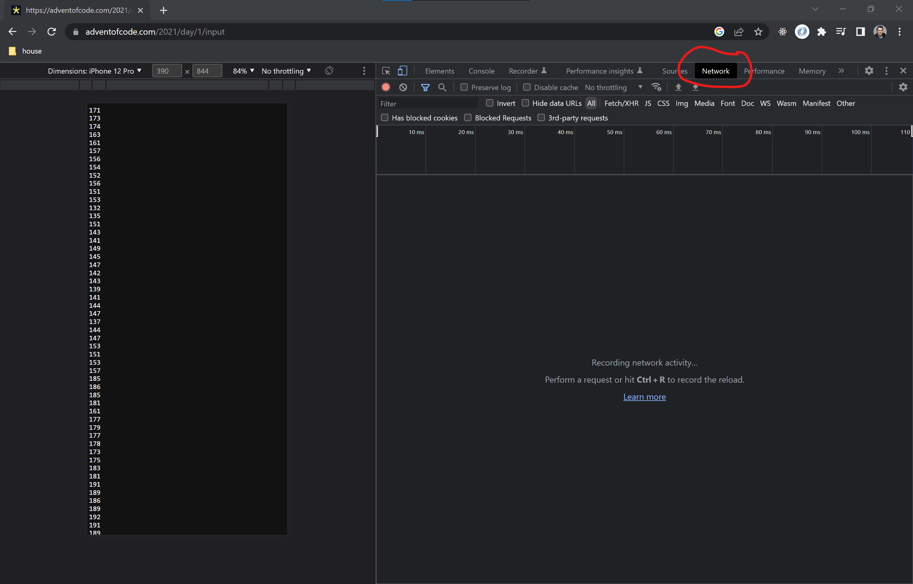
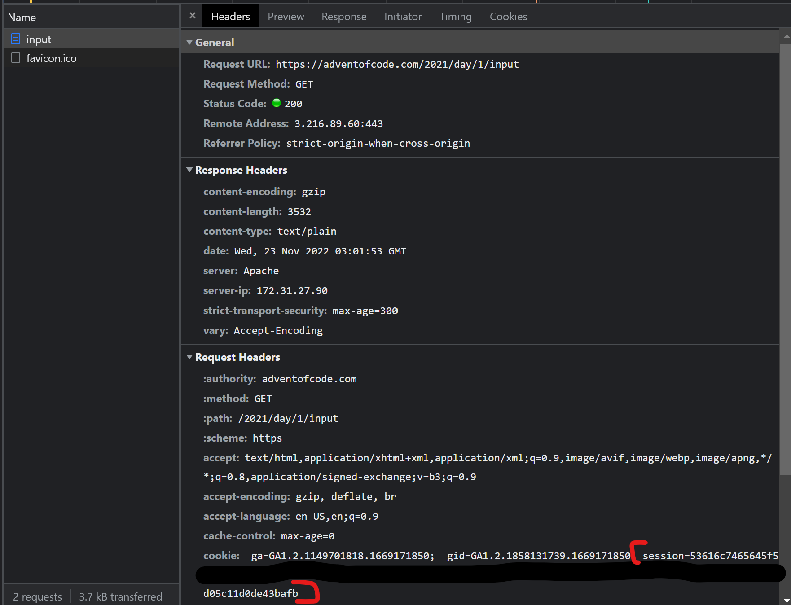

# Overview
this is a template project for advent of code that you can use for setting up your own project

> these instructions assume you have a AoC account and python installed. PyCharm optional but recommended

# Setup
1. install the packages defined in requirements.txt
2. Set the `AOC_SESSION` session token
3. Test with puzzle 2020 day 01

## 1. install the requirements
> IDEs try to be smart and may do this automatically for you. If not execute the following in a terminal
```bash
pip install -r requirements.txt
```
## 2. Set your AOC_SESSION

[click here](https://adventofcode.com/2021/day/1/input) to open up puzzle 2022 day 1. Next
open up developer tools by pressing `F12` on your keyboard. Your screen should look
something like this


#### Next open up the network tab and then refresh the page


#### You should see a `input` appear like below with a cookie named `session`.


#### Copy the contents of this `session` token and place in the [.env](.env) file as AOC_SESSION

>mine is partly blacked out but it is long and contained within the red brackets

## Test!
Open up [2021/01.py](2021/01.py) run the file, you should see the input data
printed to the console as well as other jazz.

Now, solve it! Here are the details [2021 day 01](https://adventofcode.com/2021/day/1)
 

# TDS Leaderboard
We have a [Private Leaderboard](https://adventofcode.com/2022/leaderboard/private/view/1629271?order=local_score) 

To join you will need an access code which is not listed in this project for security purposes...
Once you have the code, got to the [Leaderboard](https://adventofcode.com/2022/leaderboard/private) and
enter it in. You will then be able to navigate to with the link above